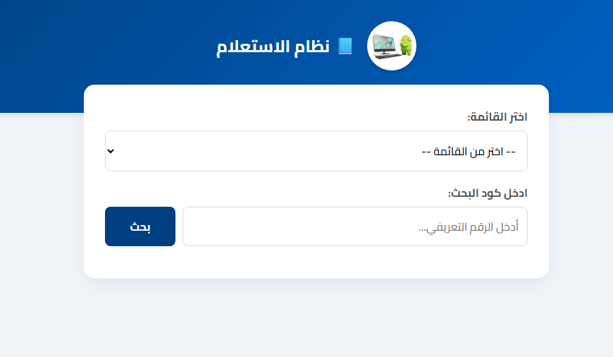
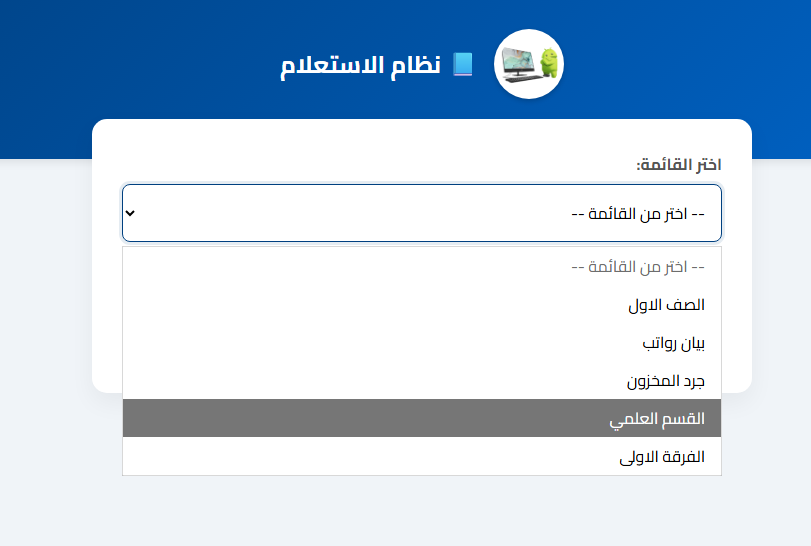
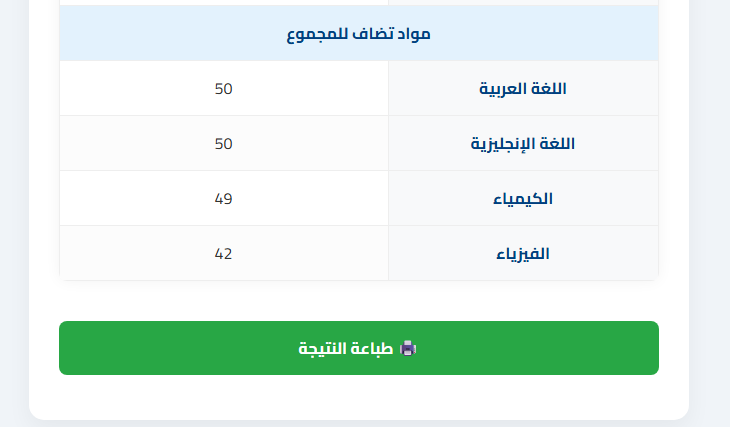
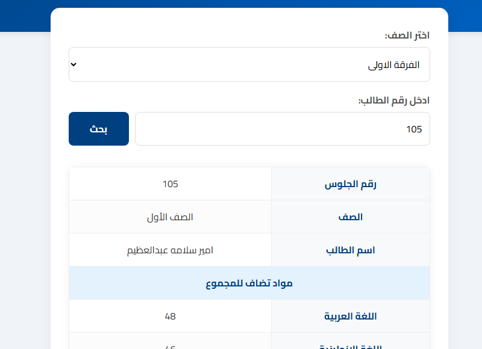
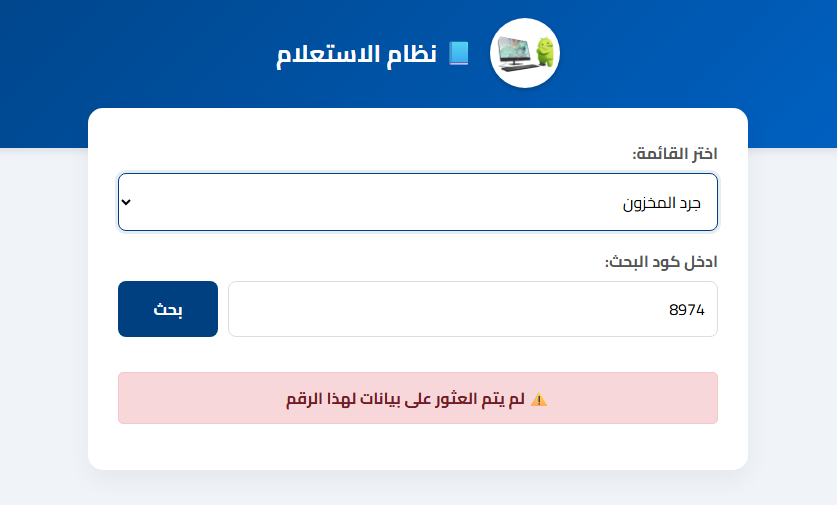
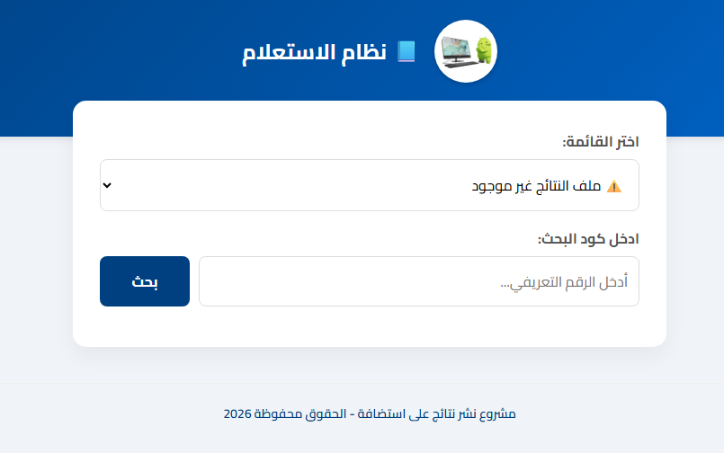

# 📘 مشروع نتيجة الطلاب

## فكرة المشروع
مشروع ويب بسيط يتيح عرض نتائج الطلاب مباشرة من ملف Excel (`natiga.xlsx`) دون الحاجة إلى قواعد بيانات.  
الواجهة مصممة لتكون سهلة الاستخدام: يختار المستخدم الصف (ورقة العمل داخل ملف Excel)، ثم يدخل رقم الطالب ليتم البحث عنه في العمود الأول، وتُعرض درجاته أو بياناته بشكل منسق وواضح.

---

## تفاصيل المرحلة الحالية (المرحلة الأولى)
- **واجهة رئيسية** تعرض قائمة الصفوف (أوراق العمل) بشكل تلقائي.
- **مربع إدخال** لرقم الطالب.
- **عرض النتائج** في جدول عمودي (كل مادة أو بند في صف مستقل).
- **تصميم RTL** متوافق مع اللغة العربية ومناسب لمختلف الشاشات (Responsive).
- **استخدام مكتبة PhpSpreadsheet** لقراءة ملف Excel مباشرة.
- **تنسيقات CSS جذابة** بألوان متناسقة مع هوية المدرسة (أزرق/أبيض).
- **رسائل خطأ ودية** عند إدخال بيانات غير صحيحة أو عدم العثور على الطالب.
- **حماية الملف** بحيث لا يمكن الوصول المباشر إلى ملف النتائج عبر الروابط، بل تتم قراءته فقط من خلال PHP.

---

## منطق عرض البيانات
- العمود الأول في الملف يجب أن يحتوي على **أرقام الطلاب**.
- باقي الأعمدة:
  - إذا كانت الخلية فارغة → يظهر العمود كـ **عنوان قسم** بعرض كامل (مثال: "مواد تضاف للمجموع").
  - إذا كانت الخلية تحتوي أي قيمة (رقم أو نص) → يظهر العمود كـ **مادة مع قيمة** بجانب اسمها.
  
بهذا الشكل يمكن للمستخدم الذي يرفع ملف Excel أن يحدد العناوين ببساطة عبر ترك الخلايا فارغة في صف الطالب.

---

## طريقة الاستخدام
### المتطلبات
- PHP 7.4 أو أحدث.
- Composer مثبت على الجهاز.
- مكتبة [PhpSpreadsheet](https://phpspreadsheet.readthedocs.io/) مثبتة عبر Composer.

### خطوات التشغيل
1. ضع الملفات التالية في مجلد المشروع:
   - `index.php` (الواجهة الرئيسية).
   - `readExcel.php` (الخلفية لمعالجة ملف Excel).
   - ملف النتائج `natiga.xlsx` بجوار الملفات.
2. ثبّت مكتبة PhpSpreadsheet:
   ```bash
   composer require phpoffice/phpspreadsheet


## صور توضيحية (Screenshots)

### الصفحة الرئيسية


### البحث عن الطالب




### رسالة خطأ ودية

